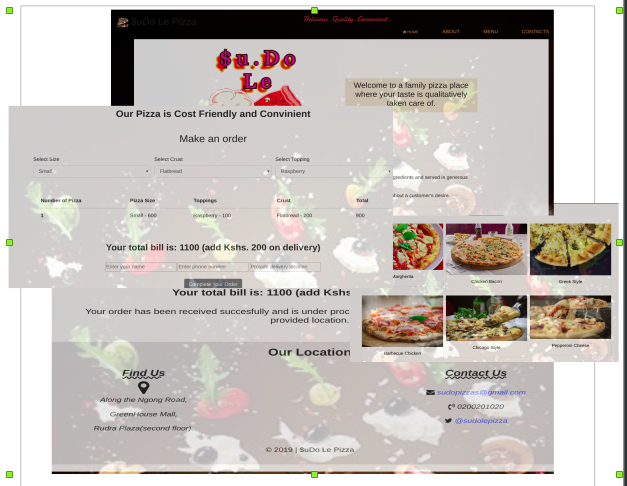

# _$uDo Le Pizza_

$uDo Le Pizza is a website that showcases the epic pizza bakes from $uDo Le Pizza shop and allows the user to do an online order by choosing the size of a pizza, the crust, and the toppings.

## Author
**Evans Nyambane** 
 

### $uDo Le Pizza

### Setup and installation requirements
- ` git clone https://github.com/DjCooGie/Su.Do-Le-Pizza.git `
- `cd Su.Do-Le-Pizza`
- `code .` # (For Visual Studio Code text editor)
- `atom .` # (for Atom text editor)
- Click the ` index.html` file to open in on your Browser.

### Languages used
1. JavaScript (jQuery 3.4.1)
2. HTML & CSS (Bootstrap)

### BDD
1. 
| Behavior |
| -------- |
| The page loads showing a landing page | 

2. 
| Inpage actions |
| -------------- |
|Scroll down to the order section.|
|`Select options` and `checkboxes` to make an order. | 
| Order confirmation loads inform of a table. |

3. 
| Output |
| ------ |
| Click `checkout button` to see total price before delivery. |
| Click `home delivery button` to fill in some details. | 
| Click `complete button` to finish the order process. |
| A confirmation message displays showing the name of the customer, the location of delivery and the total price after delivery. |

### Live link: [https://djcoogie.github.io/Su.Do-Le-Pizza/](https://djcoogie.github.io/Su.Do-Le-Pizza/)

### Bugs
On clicking the ` Coomplete Your Order ` button, the order is submitted without the user entering any detail in the form

### Support and contact details
Incase of any questions, problems ideas concerning the website, feel free to reach out to me via email.(evansonchagwa01@gmail.com)

#### License
***MIT LICENSE***

Copyright (c) 2019 **Evans Nyambane**

Permission is hereby granted, free of charge, to any person obtaining a copy
of this software and associated documentation files (the "Software"), to deal
in the Software without restriction, including without limitation the rights
to use, copy, modify, merge, publish, distribute, sublicense, and/or sell
copies of the Software, and to permit persons to whom the Software is
furnished to do so, subject to the following conditions:

The above copyright notice and this permission notice shall be included in all
copies or substantial portions of the Software.

THE SOFTWARE IS PROVIDED "AS IS", WITHOUT WARRANTY OF ANY KIND, EXPRESS OR
IMPLIED, INCLUDING BUT NOT LIMITED TO THE WARRANTIES OF MERCHANTABILITY,
FITNESS FOR A PARTICULAR PURPOSE AND NONINFRINGEMENT. IN NO EVENT SHALL THE
AUTHORS OR COPYRIGHT HOLDERS BE LIABLE FOR ANY CLAIM, DAMAGES OR OTHER
LIABILITY, WHETHER IN AN ACTION OF CONTRACT, TORT OR OTHERWISE, ARISING FROM,
OUT OF OR IN CONNECTION WITH THE SOFTWARE OR THE USE OR OTHER DEALINGS IN THE
SOFTWARE.